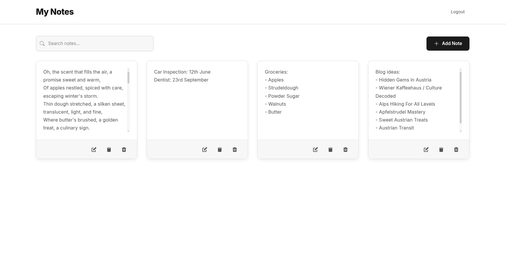

# Notes

A simple, yet effective, web-based application for creating, managing, and organizing your personal notes. Built with Python (Flask) and a clean, modern user interface.



## Features

* **User Authentication:** Secure registration and login system to keep your notes private.
* **Create Notes:** Easily add new notes with a title and detailed content.
* **Edit Notes:** Modify your existing notes anytime.
* **Delete Notes:** Remove notes you no longer need.
* **Search Notes:** Quickly find specific notes using a search bar.
* **Responsive Design:** Access your notes on desktop or mobile devices.
* **Character Counter:** Keep track of your note length with a built-in character counter.
* **Draft Saving:** Notes are automatically saved as drafts if you close the modal before saving.
* **Toast Notifications:** Get feedback on actions like saving, deleting, or errors.


## Getting Started (Docker)

**Use Docker and a Local Database**
```bash
docker run -p 5000:5000 -v /my/path:/app/instance -e DATABASE_TYPE=LOCAL antalyse/notes
```

**Use Docker and a Postgres Database**
```bash
docker run -p 5000:5000 \
  -e DATABASE_TYPE=POSTGRES \
  -e DB_SERVICE=<your_db_service_host> \
  -e DB_NAME=<your_db_name> \
  -e DB_USER=<your_db_user> \
  -e DB_PORT=<your_db_port> \
  -e DB_PASSWORD=<your_db_password> \
  antalyse/notes

```

## Getting Started (Kubernetes)

Uses Let's Encrypt Certbot for SSL Certificate

**Use a (local) Database inside the pod (not recommended)**
```bash
kubectl apply -f ./kubernetes/
```

**Use a Postgres Database**

```bash
# Update the configmap.yaml to DB_TYPE: "POSTGRES" and add the other DB related informations
# Update the secrets.yaml with DB and Flask App Secret
# Update the ingress.yaml with your host

kubectl apply -f ./kubernetes/
```

## Getting Started (Local)

### Prerequisites

* Python 3.x
* pip (Python package installer)

### Installation & Running (Local)


1.  **Clone the repository:**
    ```bash
    git clone [https://github.com/antalyse/notes.git](https://github.com/antalyse/notes.git)
    cd notes
    ```

2.  **Create a virtual environment (recommended):**
    ```bash
    python -m venv venv
    source venv/bin/activate  # On Windows use `venv\Scripts\activate`
    ```

3.  **Install dependencies:**
    ```bash
    pip install flask flask_migrate flask_sqlalchemy flask_login psycopg2-binary werkzeug
    ```

4.  **Configure Environment Variables:**
    The application uses environment variables for configuration (e.g., `FLASK_SECRET_KEY`, `DB_TYPE`, database credentials). Set these up as needed. For local development with SQLite, `DB_TYPE="LOCAL"` is the default.

5.  **Initialize the database (if running for the first time):**
    ```bash
    flask db init  # Only if you haven't initialized migrations before
    flask db migrate -m "Initial migration"
    flask db upgrade
    ```

6.  **Run the application:**
    ```bash
    python app.py
    ```
    The application will typically be available at `http://127.0.0.1:5000/`.

## Public Access

This application is freely available for public use at [app4notes.com](https://app4notes.com).
In case you need a hassle-free, managed hosting solution for this notes application, or require whitelabeling services with custom branding for your organization, you find a contact on [antalyse.com](https://antalyse.com).


## License

This project is open-source and licensed under the MIT License. See the `LICENSE` file for more details.


